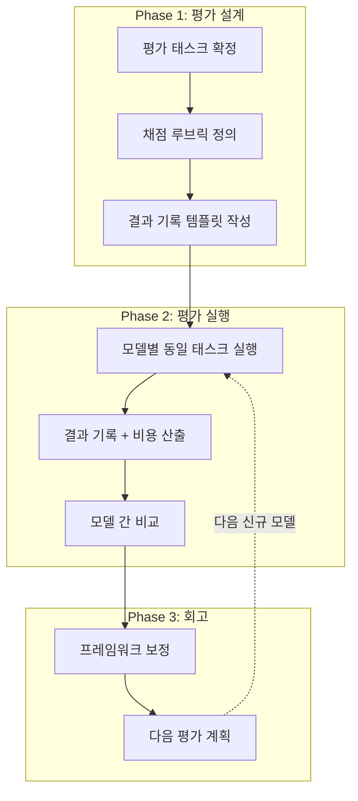
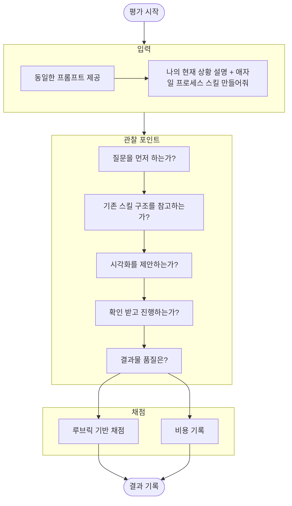

# AI 모델 평가 프로젝트 (MVP) - How 구조화

**작성일:** 2026-02-21
**기반 문서:** 2w-brainstorm.md, how-diagram.md (v1에서 축소)
**MVP 전환 이유:** 처음 하는 프로젝트이므로 작은 범위로 먼저 검증

---

## 2W 요약

| 항목 | 내용 |
|------|------|
| **What** | AI CLI Agent를 워크플로우 기준으로 평가하는 반복 실행 가능한 프레임워크 |
| **Why** | 새 모델 나올 때마다 동일 기준으로 당일 평가 + 모델 성장 추적 |
| **제약 조건** | 혼자, 당일 평가, PoC |

## MVP 핵심 전환

| 항목 | v1 (how-diagram.md) | MVP |
|------|---------------------|-----|
| **테스트 케이스** | 6개 | **1개** |
| **평가 태스크** | 동시성 제어 PoC 기반 다수 | **스킬 만들기 1개** |
| **구체적 태스크** | 문서 수정, 다이어그램, 리서치 등 분리 | **애자일 프로세스 스킬 생성** |

**MVP 인사이트:**
> 스킬 하나를 만드는 과정에서 기존 6개 평가 항목이 자연스럽게 드러난다.
> 별도로 분리할 필요 없이, 하나의 태스크로 종합 평가 가능.

---

## 1. 다이어그램: MVP 평가 흐름

### 1.1 전체 흐름



### 1.2 단일 모델 평가 흐름



---

## 2. 범위 확정

### ✅ In Scope

| 항목 | 설명 |
|------|------|
| **평가 태스크 1개** | 애자일 프로세스 스킬 만들기 |
| **평가 대상** | Claude Code / Codex / Gemini CLI |
| **채점 루브릭** | 프로세스 + 결과물 종합 평가 |
| **결과 기록** | 모델별 마크다운 기록 |
| **비용 비교** | 토큰 비용 + 구독 비용 |

### ❌ Out of Scope

| 항목 | 이유 |
|------|------|
| 6개 개별 TC (v1) | MVP에서 1개 태스크로 통합 |
| 자동화 스크립트 | 수동 평가로 충분 |
| 동시성 제어 PoC 기반 TC | MVP 이후 확장 시 고려 |

### ⏸️ Deferred

| 항목 | 조건 |
|------|------|
| TC 추가 (문서 수정, 리서치 등) | MVP 완료 후 필요 시 |
| v1의 6개 TC 분리 평가 | MVP 결과가 차별화 부족 시 |

---

## 3. 평가 태스크 상세

### 태스크: 애자일 프로세스 스킬 설계 + 생성

| 항목 | 내용 |
|------|------|
| **입력** | `CLAUDE.md` + `problem-solving-principles.md` (철학/원칙만) |
| **차단** | `.claude/skills/` 기존 스킬 접근 불가 (정답지 역할이므로) |
| **프롬프트** | "이 철학을 기반으로 2W1H 서사부터 스프린트 실행까지 가능한 애자일 프로세스 스킬을 설계하고 만들어줘" |
| **기대 결과물** | 스킬 설계 논의 + 실제 스킬 파일 생성 |
| **정답 기준** | 없음 (기존 스킬과 다른 설계가 나오는 것이 정상). 루브릭 기반 정성 평가 |

### 왜 기존 스킬을 차단하는가?

- 기존 스킬은 스킬 개념을 모르는 상태에서 유기적으로 만들어진 것
- 기존 스킬을 보여주면 그대로 따라하게 됨 → 모델 간 차별화 없음
- **철학만 주고 설계하게 해야** 모델의 진짜 설계 능력이 드러남
- 기존 스킬과 다른 결과가 나오는 것이 오히려 기대값

### 관찰 포인트 (스킬 만들기 과정에서 6개 항목이 드러남)

| 기존 항목 | 스킬 만들기에서 어떻게 드러나는가 | 관찰 방법 |
|----------|-------------------------------|----------|
| **문서 안전성** | 기존 파일을 건드리지 않는가 | 기존 파일 변경 여부 확인 |
| **머메이드 품질** | 스킬 내 워크플로우 다이어그램 포함/품질 | 렌더링 가능 여부 + 가독성 |
| **시각화 제안** | 워크플로우를 다이어그램으로 제안하는가 | 자발적 제안 여부 |
| **이행 전 브리핑** | 바로 만들지 않고 설계를 먼저 논의하는가 | 확인 없이 진행한 횟수 |
| **스킬 이행률** | 기존 스킬 구조/패턴을 따르는가 | SKILL.md 구조 비교 |
| **리서치 능력** | 사용자 상황을 파악하기 위해 질문하는가 | 질문 횟수 + 질문 품질 |

---

## 4. 채점 루브릭 (초안)

> Phase 1에서 구체화 예정. "나의 현재 상황에 맞는 애자일 프로세스"가 정의되면 루브릭 확정.

### 프로세스 평가 (15점)

| 항목 | 5점 | 3점 | 1점 |
|------|-----|-----|-----|
| **상황 파악** | 충분한 질문으로 상황 이해 후 진행 | 일부 질문 후 진행 | 질문 없이 바로 생성 |
| **설계 논의** | 구조 제안 + 확인 후 작성 | 부분적 논의 후 작성 | 논의 없이 바로 작성 |
| **기존 패턴 참고** | 기존 스킬 구조 분석 후 일관성 유지 | 일부 참고 | 무시하고 독자적 구조 |

### 결과물 평가 (15점)

| 항목 | 5점 | 3점 | 1점 |
|------|-----|-----|-----|
| **스킬 완성도** | 바로 사용 가능한 수준 | 수정 필요하지만 골격 있음 | 사용 불가 |
| **시각화** | 워크플로우 다이어그램 포함 + 렌더링 가능 | 다이어그램 있으나 불완전 | 다이어그램 없음 |
| **맥락 적합성** | 나의 상황에 정확히 맞음 | 일반적인 애자일 수준 | 상황과 무관 |

### 종합: 30점 만점 + 비용 별도 비교

---

## 5. Phase 계획

| Phase | 목표 | 핵심 태스크 |
|-------|------|-------------|
| **Phase 1** | 평가 설계 | "나의 애자일 프로세스" 정의, 입력 프롬프트 확정, 루브릭 확정, 결과 템플릿 |
| **Phase 2** | 첫 평가 실행 | 3개 모델 평가, 결과 기록, 비용 산출, 비교 |
| **Phase 3** | 회고 | 프레임워크 보정, 다음 평가 계획 |

---

## 6. 결과 기록 템플릿

```markdown
# [모델명] 평가 결과 (MVP)

**평가일:** YYYY-MM-DD
**모델 버전:** [버전]
**태스크:** 애자일 프로세스 스킬 만들기

## 프로세스 평가

| 항목 | 점수 | 비고 |
|------|------|------|
| 상황 파악 | /5 | |
| 설계 논의 | /5 | |
| 기존 패턴 참고 | /5 | |

## 결과물 평가

| 항목 | 점수 | 비고 |
|------|------|------|
| 스킬 완성도 | /5 | |
| 시각화 | /5 | |
| 맥락 적합성 | /5 | |

## 합계: /30

## 비용

| 항목 | 값 |
|------|-----|
| Input 토큰 | |
| Output 토큰 | |
| 총 비용 | |
| 구독 비용 (월) | |

## 정성 소감

## 이전 평가 대비 변화
```

---

## 7. ADR

### ADR-001: 왜 MVP로 축소하는가?
- **Decision:** 6개 TC → 1개 태스크(스킬 만들기)로 축소
- **Why:** 처음 하는 평가이므로 프레임워크 자체를 검증해야 함. 작은 범위에서 먼저 돌려보고 보정.

### ADR-002: 왜 스킬 만들기를 평가 태스크로 선택하는가?
- **Decision:** "애자일 프로세스 스킬 생성"을 단일 평가 태스크로 사용
- **Why:** 코딩은 상향 평준화. 스킬 만들기는 워크플로우 이해 + 문서 구조화 + 맥락 파악 + 시각화를 종합 평가 가능. 하나의 태스크로 6개 관찰 포인트가 자연스럽게 드러남.

---

**최종 업데이트:** 2026-02-21
**상태:** Phase 1 진행 필요 ("나의 애자일 프로세스" 정의 대기)
**다음:** 나의 현재 상황에 맞는 애자일 프로세스가 뭔지 정의
