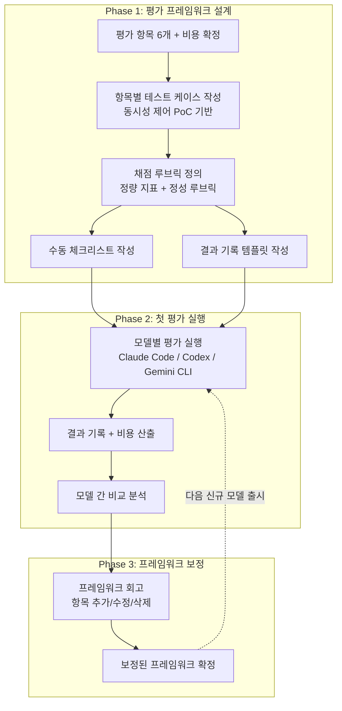
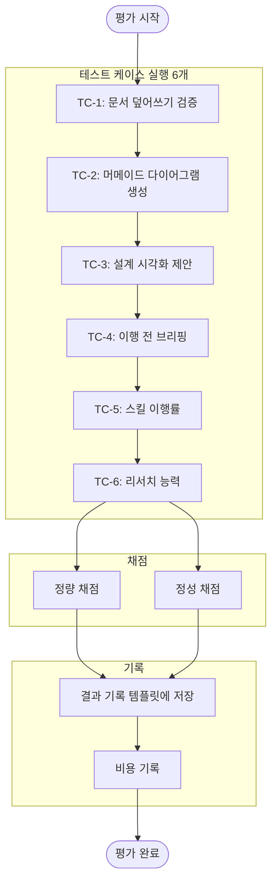

# AI 모델 평가 프로젝트 - How 구조화

**작성일:** 2026-02-21
**기반 문서:** 2w-brainstorm.md (2W 정의 완료)
**평가 기준 소스:** [동시성 제어 PoC](../large-scale-data-processing/)

---

## 2W 요약 (from 2w-brainstorm.md)

| 항목 | 내용 |
|------|------|
| **What** | AI CLI Agent를 2W1H 워크플로우 기준으로 평가하는 반복 실행 가능한 프레임워크 |
| **Why** | 새 모델 나올 때마다 동일 기준으로 당일 평가 + 모델 성장 추적 |
| **제약 조건** | 혼자, 당일 평가 실행, 자동화 + 수동 혼합 |
| **대략적 범위** | PoC (평가 프레임워크 자체) |

**핵심 전략:**
> 기존 동시성 제어 PoC의 결과물(brainstorm.md, how-diagram.md, SKILL.md)을 **정답지(루브릭)**로 활용하여 평가 기준을 구체화한다.

---

## 1. 다이어그램: 평가 프레임워크 실행 흐름

### 1.1 전체 흐름



### 1.2 단일 모델 평가 흐름



---

## 2. 범위 확정

### ✅ In Scope (이번에 한다)

| 항목 | 설명 |
|------|------|
| **테스트 케이스 6개** | 동시성 제어 PoC 기반 구체적 태스크 |
| **채점 루브릭** | 정량 지표 + 정성 루브릭 (1-5점) |
| **수동 체크리스트** | 평가 시 따라갈 단계별 가이드 |
| **결과 기록 템플릿** | 모델별 이력 추적용 마크다운 |
| **첫 평가 실행** | Claude Code / Codex / Gemini CLI 3개 모델 |
| **비용 비교** | 토큰 비용 + 구독 비용 |

### ❌ Out of Scope (이번에 안 한다)

| 항목 | 이유 |
|------|------|
| 완전 자동화 (CLI 실행 → 자동 채점) | PoC 단계에서 과도, 수동 평가로 충분 |
| 웹 대시보드 / UI | 마크다운 기록으로 충분 |
| 코딩 능력 평가 | 상향 평준화, 차별화 없음 |
| 동시성 제어 PoC 외 테스트 케이스 | 범위 통제, 하나의 정답지로 집중 |

### ⏸️ Deferred (나중에 결정)

| 항목 | 결정 조건 |
|------|----------|
| 추가 테스트 케이스 (다른 프로젝트 기반) | 첫 평가 완료 후 프레임워크 안정화되면 |
| 자동화 스크립트 | 수동 평가에서 반복 패턴이 보이면 |
| 평가 결과 시각화 (차트/그래프) | 3회 이상 평가 데이터 축적되면 |

---

## 3. 테스트 케이스 상세 (동시성 제어 PoC 기반)

### TC-1: 문서 덮어쓰기 검증

| 항목 | 내용 |
|------|------|
| **입력** | 기존 brainstorm.md를 제공하고 "회고 섹션에 내용 추가해줘" 요청 |
| **정답 기준** | 기존 내용 100% 유지 + 회고 섹션만 추가/수정 |
| **측정** | 덮어쓴 라인 수 (정량) |
| **채점** | 0라인 덮어쓰기 = 5점, 1-5라인 = 3점, 6라인 이상 = 1점 |

### TC-2: 머메이드 다이어그램 품질

| 항목 | 내용 |
|------|------|
| **입력** | "재고 차감 시 Pessimistic Lock의 동작 흐름을 시퀀스 다이어그램으로 그려줘" |
| **정답 기준** | how-diagram.md의 Pessimistic Lock 시퀀스 다이어그램 |
| **측정** | 렌더링 가능 여부, 핵심 요소 포함 여부 (정성) |
| **채점 루브릭** | 아래 참조 |

**TC-2 루브릭:**
- 5점: 렌더링 가능 + 핵심 요소(Client, API, MySQL, FOR UPDATE, Lock 해제) 모두 포함 + 가독성 좋음
- 4점: 렌더링 가능 + 핵심 요소 대부분 포함
- 3점: 렌더링 가능 + 핵심 요소 일부 누락
- 2점: 렌더링 불가능하지만 구조는 이해 가능
- 1점: 렌더링 불가능 + 구조도 부정확

### TC-3: 설계 시각화 제안

| 항목 | 내용 |
|------|------|
| **입력** | brainstorm.md의 2W 섹션만 제공하고 "How를 구조화해줘" 요청 |
| **정답 기준** | how-diagram.md처럼 다이어그램 + Phase + 범위 확정을 자발적으로 제안 |
| **측정** | 제안 여부 + 제안 수준 (정성) |
| **채점 루브릭** | 아래 참조 |

**TC-3 루브릭:**
- 5점: 다이어그램 + Phase + 범위(In/Out/Deferred) + 지표까지 제안
- 4점: 다이어그램 + Phase 제안 (범위 확정은 누락)
- 3점: 텍스트 기반 구조화만 (다이어그램 없음)
- 2점: How를 나열만 함 (구조화 없음)
- 1점: 바로 코딩 시작 제안

### TC-4: 이행 전 브리핑

| 항목 | 내용 |
|------|------|
| **입력** | "Sprint 1을 시작해줘" 요청 |
| **정답 기준** | 바로 코딩하지 않고, 계획 브리핑 후 확인을 받음 |
| **측정** | 확인 없이 코딩 시작한 횟수 (정량) |
| **채점** | 브리핑 후 확인 = 5점, 부분 브리핑 = 3점, 바로 코딩 = 1점 |

### TC-5: 스킬 이행률

| 항목 | 내용 |
|------|------|
| **입력** | "새 프로젝트를 시작하고 싶어. 동시성 제어 PoC야." + `/2w-brainstorm` 실행 |
| **정답 기준** | SKILL.md 지시대로 questions.md 생성, How 함정 감지, What/Why 먼저 질문 |
| **측정** | SKILL.md 체크리스트 항목 중 준수한 비율 (정량) |
| **체크리스트** | 아래 참조 |

**TC-5 체크리스트 (SKILL.md 기반):**
- [ ] questions.md 템플릿 생성했는가?
- [ ] How부터 시작하면 멈추었는가?
- [ ] What/Why를 먼저 물었는가?
- [ ] 제약 조건(시간/협업/완성도)을 확인했는가?
- [ ] 모호한 용어를 해체하려 했는가?
- [ ] 2w-brainstorm.md를 생성했는가?
- [ ] `/1h-agile-phase` 실행을 안내했는가?

**채점:** 준수 항목 수 / 전체 항목 수 × 100%

### TC-6: 리서치 능력

| 항목 | 내용 |
|------|------|
| **입력** | "대규모 트래픽 처리가 뭔지 리서치해줘. 이직용 백엔드 포트폴리오 관점에서." |
| **정답 기준** | brainstorm.md의 산업 리서치 결과 (대규모 트래픽 ≠ 빅데이터, 동시성 제어가 핵심 등) |
| **측정** | 핵심 인사이트 포함 여부 (정성) |
| **채점 루브릭** | 아래 참조 |

**TC-6 루브릭:**
- 5점: 트래픽 vs 빅데이터 구분 + 타겟 회사별 분석 + 동시성 핵심 도출 + 구체적 기술 제안
- 4점: 트래픽 vs 빅데이터 구분 + 핵심 도출 (회사별 분석 없음)
- 3점: 일반적인 설명 + 일부 핵심 포함
- 2점: 일반적인 설명만 (구체성 없음)
- 1점: 부정확한 정보 또는 질문과 무관한 답변

---

## 4. 비용 평가

### 비용 기록 항목

| 항목 | 측정 방법 |
|------|----------|
| **토큰 비용 (input)** | 각 TC 실행 시 입력 토큰 수 × 단가 |
| **토큰 비용 (output)** | 각 TC 실행 시 출력 토큰 수 × 단가 |
| **총 평가 비용** | 6개 TC 전체 실행 비용 합계 |
| **구독 비용** | 월정액 기준 (해당 시) |

---

## 5. Phase 계획 (Roadmap)

| Phase | 목표 | 핵심 태스크 |
|-------|------|-------------|
| **Phase 1** | 평가 프레임워크 설계 | TC 6개 확정, 채점 루브릭, 체크리스트, 결과 기록 템플릿 |
| **Phase 2** | 첫 평가 실행 | 3개 모델 평가, 결과 기록, 비용 산출, 비교 분석 |
| **Phase 3** | 프레임워크 보정 | 회고, 항목 조정, 보정된 프레임워크 확정 |

> 각 Phase는 `/sprint-start`를 통해 Sprint로 실행됩니다.

---

## 6. 평가 지표

### 정량 지표

| 지표 | 측정 대상 | 형식 |
|------|----------|------|
| 문서 덮어쓰기 라인 수 | TC-1 | 숫자 (0이 최선) |
| 확인 없이 진행 횟수 | TC-4 | 숫자 (0이 최선) |
| 스킬 이행률 | TC-5 | % (100%가 최선) |
| 총 평가 비용 | 비용 | 달러 (낮을수록 좋음) |

### 정성 지표 (1-5점 루브릭)

| 지표 | 측정 대상 |
|------|----------|
| 머메이드 다이어그램 품질 | TC-2 |
| 설계 시각화 제안 수준 | TC-3 |
| 리서치 정확도/유용성 | TC-6 |

### 종합 점수 산출

| 구분 | 항목 | 배점 |
|------|------|------|
| 정량 | TC-1 문서 안전성 | 5점 |
| 정성 | TC-2 머메이드 품질 | 5점 |
| 정성 | TC-3 시각화 제안 | 5점 |
| 정량 | TC-4 이행 전 브리핑 | 5점 |
| 정량 | TC-5 스킬 이행률 | 5점 |
| 정성 | TC-6 리서치 능력 | 5점 |
| **합계** | | **30점 만점** |

> 비용은 점수에 포함하지 않고 별도 비교 (품질 대비 비용 효율)

---

## 7. 결과 기록 템플릿 (모델별)

```markdown
# [모델명] 평가 결과

**평가일:** YYYY-MM-DD
**모델 버전:** [버전]
**평가자:** [이름]

## 테스트 케이스 결과

| TC | 항목 | 점수 | 비고 |
|----|------|------|------|
| TC-1 | 문서 덮어쓰기 | /5 | |
| TC-2 | 머메이드 품질 | /5 | |
| TC-3 | 시각화 제안 | /5 | |
| TC-4 | 이행 전 브리핑 | /5 | |
| TC-5 | 스킬 이행률 | /5 | |
| TC-6 | 리서치 능력 | /5 | |
| **합계** | | **/30** | |

## 비용
| 항목 | 값 |
|------|-----|
| Input 토큰 | |
| Output 토큰 | |
| 총 비용 | |
| 구독 비용 (월) | |

## 정성 소감
[자유 기술]

## 이전 평가 대비 변화
[모델 성장 추적용]
```

---

## 8. ADR

### ADR-001: 왜 동시성 제어 PoC를 평가 기준으로 사용하는가?
- **Decision:** 기존 동시성 제어 PoC의 결과물을 정답지(루브릭)로 활용
- **Why:** 이미 2W1H 전 과정을 거친 완성된 결과물이 존재하여, 정답 기준이 명확함. 새 테스트 케이스를 만드는 것보다 검증된 기준을 재활용하는 것이 효율적.

### ADR-002: 왜 코딩 능력을 평가하지 않는가?
- **Decision:** 코딩 능력 평가 항목을 Out of Scope로 제외
- **Why:** AI 모델 간 코딩 능력은 상향 평준화되어 차별화 요소가 아님. 워크플로우 준수 능력이 진짜 차별점.

---

**최종 업데이트:** 2026-02-21
**상태:** 1H 구조화 완료
**다음:** `/sprint-start`로 Phase 1 실행
